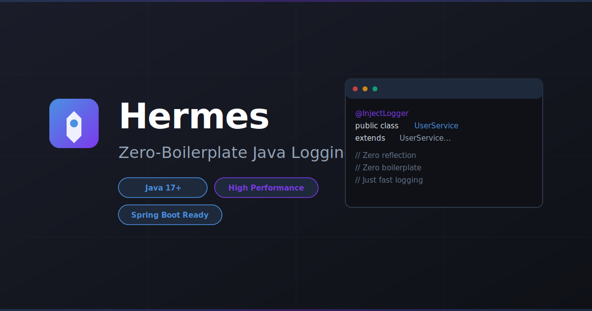

# Hermes ⚡





**High-performance logging library for Java with excellent developer experience**

Inspired by SLF4J, Hermes is a modern logging library that focuses on performance and developer productivity. Named after the Greek messenger god, Hermes delivers your log messages swiftly and reliably.

## Features

- 🚀 **Zero-boilerplate logging** - Use `@InjectLogger` annotation for automatic logger field injection
- ⚡ **High performance** - Async logging with LMAX Disruptor and zero-allocation optimization
- 🎯 **Fluent API** - Parameterized logging with `{}` placeholders
- ⚙️ **Easy configuration** - Configure via `application.yaml` with sensible defaults
- 🔧 **Spring Boot integration** - Auto-configuration support
- 🧵 **Thread-safe** - Built for concurrent applications
- 📝 **MDC support** - Mapped Diagnostic Context for contextual logging
- 🎨 **Markers** - Tag and categorize log messages
- 📁 **Multiple appenders** - Console, File, RollingFile, Async with Disruptor
- 📊 **JSON structured logging** - Built-in JSON layout for log aggregation
- 🎯 **Pattern layouts** - Customizable log output patterns

## Quick Start

### Maven

```xml
<dependencies>
    <!-- Core API -->
    <dependency>
        <groupId>io.github.dotbrains</groupId>
        <artifactId>hermes-api</artifactId>
        <version>1.0.0</version>
    </dependency>

    <!-- Annotation processor (for @InjectLogger) -->
    <dependency>
        <groupId>io.github.dotbrains</groupId>
        <artifactId>hermes-processor</artifactId>
        <version>1.0.0</version>
        <scope>provided</scope>
    </dependency>

    <!-- Core implementation -->
    <dependency>
        <groupId>io.github.dotbrains</groupId>
        <artifactId>hermes-core</artifactId>
        <version>1.0.0</version>
        <scope>runtime</scope>
    </dependency>
</dependencies>

<build>
    <plugins>
        <plugin>
            <groupId>org.apache.maven.plugins</groupId>
            <artifactId>maven-compiler-plugin</artifactId>
            <configuration>
                <annotationProcessorPaths>
                    <path>
                        <groupId>io.github.dotbrains</groupId>
                        <artifactId>hermes-processor</artifactId>
                        <version>1.0.0</version>
                    </path>
                </annotationProcessorPaths>
            </configuration>
        </plugin>
    </plugins>
</build>
```

### Gradle

```gradle
dependencies {
    implementation 'io.github.dotbrains:hermes-api:1.0.0'
    annotationProcessor 'io.github.dotbrains:hermes-processor:1.0.0'
    runtimeOnly 'io.github.dotbrains:hermes-core:1.0.0'
}
```

## Usage

### Basic Usage with @InjectLogger

```java
import io.github.dotbrains.InjectLogger;

@InjectLogger
public class UserService extends UserServiceHermesLogger {

    public void createUser(String username) {
        log.info("Creating user: {}", username);
        log.debug("User details: {}", getUserDetails(username));

        try {
            saveToDatabase(username);
            log.info("User {} created successfully", username);
        } catch (Exception e) {
            log.error("Failed to create user: {}", username, e);
        }
    }
}
```

The `@InjectLogger` annotation automatically generates a logger field named `log` at compile time. Your class needs to extend the generated base class (e.g., `UserServiceHermesLogger`).

### Manual Logger Creation

If you prefer not to use annotation processing:

```java
import io.github.dotbrains.Logger;
import io.github.dotbrains.LoggerFactory;

public class UserService {
    private static final Logger log = LoggerFactory.getLogger(UserService.class);

    public void createUser(String username) {
        log.info("Creating user: {}", username);
    }
}
```

### Log Levels

Hermes supports five log levels (from least to most severe):

```java
log.trace("Detailed debug information");
log.debug("Debug information");
log.info("Informational messages");
log.warn("Warning messages");
log.error("Error messages");
```

### Parameterized Logging

Use `{}` placeholders for efficient parameterized logging:

```java
// Single parameter
log.info("User {} logged in", username);

// Multiple parameters
log.debug("Processing order {} for user {} with total {}", orderId, username, total);

// With exception (always last parameter)
log.error("Failed to process order {}", orderId, exception);
```

### Lazy Evaluation with Suppliers

For expensive operations, use suppliers to avoid computation when logging is disabled:

```java
log.debug(() -> "Expensive computation result: " + expensiveOperation());
```

### Mapped Diagnostic Context (MDC)

Add contextual information to logs using MDC:

```java
import io.github.dotbrains.MDC;

public void processRequest(String requestId, String userId) {
    MDC.put("requestId", requestId);
    MDC.put("userId", userId);

    try {
        log.info("Processing request");  // Will include requestId and userId in output
        // ... processing logic
    } finally {
        MDC.clear();  // Always clear MDC when done
    }
}
```

### Markers

Use markers to categorize and filter logs:

```java
import io.github.dotbrains.Marker;
import io.github.dotbrains.MarkerFactory;

Marker securityMarker = MarkerFactory.getMarker("SECURITY");
log.warn(securityMarker, "Failed login attempt for user: {}", username);
```

## Advanced Features

### Appenders

Hermes supports multiple appender types:

#### Console Appender
```java
import io.github.dotbrains.core.appender.ConsoleAppender;
import io.github.dotbrains.core.layout.PatternLayout;

ConsoleAppender appender = new ConsoleAppender(
    "console",
    new PatternLayout("%d{HH:mm:ss.SSS} %-5level %logger - %msg%n")
);
appender.start();
```

#### File Appender
```java
import io.github.dotbrains.core.appender.FileAppender;

FileAppender appender = new FileAppender("file", "logs/app.log");
appender.start();
```

#### Rolling File Appender
```java
import io.github.dotbrains.core.appender.RollingFileAppender;

RollingFileAppender appender = new RollingFileAppender(
    "rolling",
    "logs/app.log",
    10 * 1024 * 1024, // 10MB max file size
    30 // keep 30 files
);
appender.start();
```

#### Async Appender (High-Performance)
```java
import io.github.dotbrains.core.appender.AsyncAppender;
import java.util.List;

// Wrap any appenders with async processing using LMAX Disruptor
AsyncAppender asyncAppender = new AsyncAppender(
    "async",
    List.of(consoleAppender, fileAppender),
    2048 // ring buffer size
);
asyncAppender.start();
```

### JSON Structured Logging

For log aggregation systems, use JSON layout:

```java
import io.github.dotbrains.core.layout.JsonLayout;
import io.github.dotbrains.core.appender.FileAppender;

// Compact JSON (one line per log)
JsonLayout jsonLayout = new JsonLayout();
FileAppender jsonAppender = new FileAppender("json", "logs/app.json", jsonLayout);

// Pretty-printed JSON (for debugging)
JsonLayout prettyLayout = new JsonLayout(true);
```

Example JSON output:
```json
{
  "timestamp": "2026-01-10T04:58:51.123Z",
  "level": "INFO",
  "logger": "com.example.UserService",
  "thread": "main",
  "threadId": "1",
  "message": "User john.doe created successfully",
  "mdc": {
    "requestId": "req-789",
    "userId": "12345"
  }
}
```

### Logstash Integration

Send logs directly to Logstash for ELK stack integration:

```java
import io.github.dotbrains.core.appender.LogstashAppender;

LogstashAppender logstash = new LogstashAppender(
    "logstash",
    "localhost",  // Logstash host
    5000          // Logstash TCP input port
);
logstash.start();
```

Configure Logstash to receive logs:
```ruby
input {
  tcp {
    port => 5000
    codec => json
  }
}
```

### Kotlin DSL

For Kotlin projects, use the idiomatic Kotlin DSL (requires Java 17+):

```kotlin
import io.github.dotbrains.kotlin.*

class UserService {
    private val log = UserService::class.logger

    fun createUser(userId: String, username: String) {
        // Lazy evaluation
        log.info { "Creating user: $username" }

        // MDC with automatic cleanup
        withMDC("userId" to userId, "username" to username) {
            log.info { "Processing user" }
        }

        // Structured logging DSL
        log.infoWith {
            "message" to "User created"
            "userId" to userId
            "username" to username
            "timestamp" to System.currentTimeMillis()
        }
    }
}
```

### GraalVM Native Image

Hermes includes GraalVM native-image metadata for compilation to native executables:

```bash
native-image --no-fallback -jar myapp.jar
```

Metadata is automatically included in `hermes-core` under `META-INF/native-image/`.

## Configuration

### application.yaml

```yaml
hermes:
  # Root log level and package-specific levels
  level:
    root: INFO
    packages:
      io.github.dotbrains: DEBUG
      com.myapp: TRACE

  # Log pattern (used by all appenders)
  pattern: "%d{yyyy-MM-dd HH:mm:ss.SSS} [%thread] %-5level %logger{36} - %msg%n"

  # Async logging configuration
  async:
    enabled: true
    queue-size: 1024
```

**Note:** The current implementation uses these three main configuration options. Appenders are configured programmatically in your application code (see Advanced Features section).

### Programmatic Configuration

Configuration is primarily done through `application.yaml` for Spring Boot applications. For programmatic control of log levels, use the Logger API's level checking methods:

```java
import io.github.dotbrains.Logger;
import io.github.dotbrains.LoggerFactory;

Logger log = LoggerFactory.getLogger(MyClass.class);

// Check log level before expensive operations
if (log.isDebugEnabled()) {
    log.debug("Debug info: {}", expensiveOperation());
}
```

## Spring Boot Integration

Add the Spring Boot starter:

```xml
<dependency>
    <groupId>io.github.dotbrains</groupId>
    <artifactId>hermes-spring-boot-starter</artifactId>
    <version>1.0.0</version>
</dependency>
```

Configuration in `application.yml`:

```yaml
hermes:
  level:
    root: INFO
    packages:
      com.example: DEBUG
  pattern: "%d{yyyy-MM-dd HH:mm:ss.SSS} [%thread] %-5level %logger{36} - %msg%n"
  async:
    enabled: true
    queue-size: 1024
```

Hermes will auto-configure with Spring Boot and integrate with Spring's logging infrastructure.

## Performance Tips

1. **Use async logging** for high-throughput applications
2. **Check log level** before expensive operations:
   ```java
   if (log.isDebugEnabled()) {
       log.debug("Result: {}", expensiveComputation());
   }
   ```
3. **Use suppliers** for lazy evaluation
4. **Avoid string concatenation** - use parameterized logging instead

## Architecture

Hermes follows a modular architecture:

- **hermes-api**: Core interfaces and annotations
- **hermes-core**: High-performance implementation
- **hermes-processor**: Annotation processor for `@InjectLogger`
- **hermes-spring-boot-starter**: Spring Boot auto-configuration
- **hermes-kotlin**: Kotlin DSL extensions
- **hermes-examples**: Example applications

For a deep dive into the system design, performance optimizations, and architectural decisions, see [ARCHITECTURE.md](ARCHITECTURE.md).

## Comparison with SLF4J

| Feature | SLF4J | Hermes |
|---------|-------|--------|
| Logger injection | Manual or Lombok | `@InjectLogger` annotation |
| Configuration | XML/Properties | YAML with sensible defaults |
| Async logging | Via Logback/Log4j | Built-in with Disruptor |
| Performance | Good | Optimized for zero-allocation |
| Spring Boot | External starters | Native integration |
| Java version | 8+ | 17+ (modern Java features) |

## Building from Source

```bash
cd hermes
mvn clean install
```

## Requirements

- Java 17 or higher
- Maven 3.8+ or Gradle 7+

## License

MIT License - see LICENSE file for details

## Contributing

Contributions are welcome! Please feel free to submit a Pull Request.

## Acknowledgments

Inspired by SLF4J and named after Hermes, the Greek messenger god associated with communication, writing, and the invention of the alphabet.
