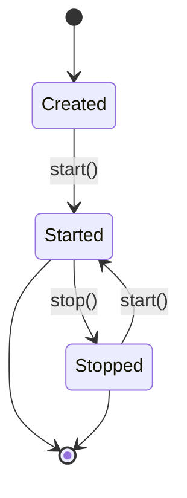

# Appenders API

API reference for built-in appenders and creating custom appenders.

## Appender Interface

Base interface all appenders must implement.

### Package

```java
io.github.dotbrains.core.appender.Appender
```

### Methods

```java
void append(LogEvent event)
void start()
void stop()
boolean isStarted()
void setLayout(Layout layout)
Layout getLayout()
```

### Lifecycle



## ConsoleAppender

Writes log events to stdout or stderr.

### Constructor

```java
ConsoleAppender()
```

### Methods

```java
void setTarget(Target target)  // STDOUT or STDERR
Target getTarget()
```

### Example

```java
ConsoleAppender appender = new ConsoleAppender();
appender.setTarget(ConsoleAppender.Target.STDOUT);
appender.setLayout(new PatternLayout("%d %-5level %msg%n"));
appender.start();
```

## FileAppender

Writes log events to a file.

### Constructor

```java
FileAppender(String filename)
```

### Methods

```java
void setAppend(boolean append)
void setBufferSize(int size)
void setImmediateFlush(boolean immediateFlush)
void flush()
```

### Example

```java
FileAppender appender = new FileAppender("application.log");
appender.setAppend(true);
appender.setBufferSize(8192);
appender.setImmediateFlush(false);
appender.setLayout(new PatternLayout("%d %-5level %logger - %msg%n"));
appender.start();
```

## RollingFileAppender

Writes to file with automatic rolling based on size or time.

### Constructor

```java
RollingFileAppender(String filename, String filePattern)
```

### Methods

```java
void setMaxFileSize(String size)  // e.g., "10MB", "1GB"
void setMaxHistory(int maxHistory)
void setTotalSizeCap(String size)
void setRollingPolicy(RollingPolicy policy)  // SIZE, TIME, SIZE_AND_TIME
```

### Rolling Policies

- **SIZE**: Roll when file reaches max size
- **TIME**: Roll daily/hourly based on pattern
- **SIZE_AND_TIME**: Roll on both conditions

### Example

```java
RollingFileAppender appender = new RollingFileAppender(
    "logs/app.log",
    "logs/app-%d{yyyy-MM-dd}.log.gz"
);
appender.setMaxFileSize("10MB");
appender.setMaxHistory(30);  // Keep 30 days
appender.setTotalSizeCap("1GB");  // Max total size
appender.setRollingPolicy(RollingPolicy.SIZE_AND_TIME);
appender.setLayout(new PatternLayout("%d %-5level %msg%n"));
appender.start();
```

## AsyncAppender

Wraps other appenders with asynchronous processing using LMAX Disruptor.

### Constructor

```java
AsyncAppender(Appender wrappedAppender)
```

### Methods

```java
void setQueueSize(int size)
void setBlockWhenFull(boolean block)
void setTimeout(long timeout)
long getDroppedEventCount()
long getQueueSize()
long getCurrentQueueUtilization()
```

### Example

```java
FileAppender fileAppender = new FileAppender("app.log");
fileAppender.setLayout(new PatternLayout("%d %-5level %msg%n"));

AsyncAppender asyncAppender = new AsyncAppender(fileAppender);
asyncAppender.setQueueSize(8192);
asyncAppender.setBlockWhenFull(false);
asyncAppender.setTimeout(1000);
asyncAppender.start();

// Monitor
long dropped = asyncAppender.getDroppedEventCount();
if (dropped > 0) {
    System.err.println("Dropped " + dropped + " events");
}
```

## LogstashAppender

Sends structured log events to Logstash via TCP.

### Constructor

```java
LogstashAppender(String host, int port)
```

### Methods

```java
void setApplicationName(String name)
void setEnvironment(String env)
void setHostname(String hostname)
void setVersion(String version)
void addField(String key, String value)
void setConnectionTimeout(int timeout)
void setWriteTimeout(int timeout)
void setReconnectDelay(int delay)
void setMaxReconnectAttempts(int attempts)
boolean isConnected()
long getSentEventCount()
long getFailedEventCount()
```

### Example

```java
LogstashAppender appender = new LogstashAppender("logstash.example.com", 5000);
appender.setApplicationName("order-service");
appender.setEnvironment("production");
appender.setHostname("app-server-01");
appender.setVersion("1.2.3");
appender.addField("datacenter", "us-east-1");
appender.setConnectionTimeout(5000);
appender.setWriteTimeout(10000);
appender.setReconnectDelay(1000);
appender.setMaxReconnectAttempts(10);
appender.start();

// Check connection
if (!appender.isConnected()) {
    System.err.println("Not connected to Logstash");
}
```

## Custom Appender Implementation

### Basic Template

```java
public class CustomAppender implements Appender {
    private volatile boolean started = false;
    private Layout layout;
    
    @Override
    public void append(LogEvent event) {
        if (!started) {
            return;
        }
        
        String formattedMessage = layout.format(event);
        // Write to custom destination
    }
    
    @Override
    public void start() {
        // Initialize resources
        started = true;
    }
    
    @Override
    public void stop() {
        // Clean up resources
        started = false;
    }
    
    @Override
    public boolean isStarted() {
        return started;
    }
    
    @Override
    public void setLayout(Layout layout) {
        this.layout = layout;
    }
    
    @Override
    public Layout getLayout() {
        return layout;
    }
}
```

### Database Appender Example

```java
public class DatabaseAppender implements Appender {
    private volatile boolean started = false;
    private Layout layout;
    private DataSource dataSource;
    
    public DatabaseAppender(DataSource dataSource) {
        this.dataSource = dataSource;
    }
    
    @Override
    public void append(LogEvent event) {
        if (!started) return;
        
        try (Connection conn = dataSource.getConnection();
             PreparedStatement stmt = conn.prepareStatement(
                 "INSERT INTO logs (timestamp, level, logger, message) VALUES (?, ?, ?, ?)")) {
            
            stmt.setTimestamp(1, Timestamp.from(event.timestamp()));
            stmt.setString(2, event.level().toString());
            stmt.setString(3, event.loggerName());
            stmt.setString(4, event.message());
            stmt.executeUpdate();
            
        } catch (SQLException e) {
            System.err.println("Failed to write log to database: " + e.getMessage());
        }
    }
    
    @Override
    public void start() {
        started = true;
    }
    
    @Override
    public void stop() {
        started = false;
    }
    
    @Override
    public boolean isStarted() {
        return started;
    }
    
    @Override
    public void setLayout(Layout layout) {
        this.layout = layout;
    }
    
    @Override
    public Layout getLayout() {
        return layout;
    }
}
```

## Filtering

### Level-Based Filtering

```java
public class FilteringAppender implements Appender {
    private Appender delegate;
    private LogLevel minLevel;
    private LogLevel maxLevel;
    
    @Override
    public void append(LogEvent event) {
        if (event.level().isGreaterOrEqual(minLevel) && 
            !event.level().isGreaterOrEqual(maxLevel)) {
            delegate.append(event);
        }
    }
    // ... other methods
}
```

### Marker-Based Filtering

```java
public class MarkerFilteringAppender implements Appender {
    private Appender delegate;
    private Set<String> acceptedMarkers;
    
    @Override
    public void append(LogEvent event) {
        if (event.marker() != null && 
            acceptedMarkers.contains(event.marker().getName())) {
            delegate.append(event);
        }
    }
    // ... other methods
}
```

## Best Practices

1. **Always implement lifecycle methods properly**
2. **Handle exceptions gracefully** - don't let appender failures crash the application
3. **Make thread-safe** - multiple threads may log concurrently
4. **Clean up resources** in `stop()` method
5. **Use buffering** for I/O-intensive appenders
6. **Consider async wrapping** for slow appenders
7. **Monitor performance** - track dropped events, write times
