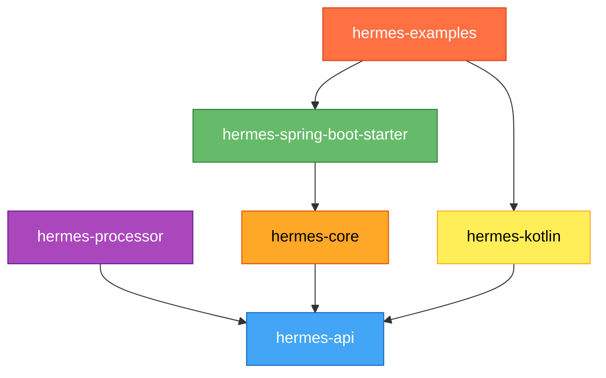

# Module Structure

Hermes follows a modular architecture with clear separation of concerns across six Maven modules.

## Module Overview

```
hermes (parent)
├── hermes-api          (Pure API, no dependencies)
├── hermes-core         (Implementation, depends on hermes-api)
├── hermes-processor    (Annotation processor, depends on hermes-api)
├── hermes-spring-boot-starter  (Spring integration, depends on hermes-core)
├── hermes-kotlin       (Kotlin DSL, depends on hermes-api)
└── hermes-examples     (Example applications)
```

## hermes-api

**Purpose**: Core public interfaces and annotations

### Key Components

- `Logger`: Main logging interface
- `LoggerFactory`: Static factory for logger instances
- `LoggerProvider`: SPI interface for implementations
- `@InjectLogger`: Annotation for logger injection
- `MDC`: Mapped Diagnostic Context
- `Marker`, `MarkerFactory`: Log categorization
- `LogLevel`: Log level enumeration

### Dependencies

None - pure API module

### Module Info

```java
module io.github.dotbrains.hermes.api {
    exports io.github.dotbrains;
    uses io.github.dotbrains.spi.LoggerProvider;
}
```

## hermes-core

**Purpose**: High-performance implementation

### Key Components

#### Core Implementation

- `HermesLogger`: Concrete Logger implementation
- `HermesLoggerProvider`: ServiceLoader provider
- `LogEvent`: Immutable log event record
- `MessageFormatter`: Zero-allocation formatting

#### Appenders

- `ConsoleAppender`: stdout/stderr output
- `FileAppender`: File output
- `RollingFileAppender`: Size/time-based rolling
- `AsyncAppender`: LMAX Disruptor async logging
- `LogstashAppender`: TCP to Logstash

#### Layouts

- `PatternLayout`: Configurable pattern formatting
- `JsonLayout`: JSON structured output

### Dependencies

- `hermes-api` (compile)
- `lmax-disruptor` (optional, for AsyncAppender)

### Module Info

```java
module io.github.dotbrains.hermes.core {
    requires io.github.dotbrains.hermes.api;
    requires static com.lmax.disruptor;

    exports io.github.dotbrains.core;
    exports io.github.dotbrains.core.appender;
    exports io.github.dotbrains.core.layout;

    provides io.github.dotbrains.spi.LoggerProvider
        with io.github.dotbrains.core.HermesLoggerProvider;
}
```

## hermes-processor

**Purpose**: Compile-time annotation processing

### Key Components

- `InjectLoggerProcessor`: Processes `@InjectLogger`
- `LoggerFieldGenerator`: Generates base classes

### How It Works

1. Scans for `@InjectLogger` annotations
2. Generates `<ClassName>HermesLogger` base class
3. Adds `protected final Logger log` field
4. Output to `target/generated-sources/annotations/`

### Dependencies

- `hermes-api` (compile)
- Java Compiler API

### Usage

Configured in `maven-compiler-plugin`:

```xml
<plugin>
    <groupId>org.apache.maven.plugins</groupId>
    <artifactId>maven-compiler-plugin</artifactId>
    <configuration>
        <annotationProcessorPaths>
            <path>
                <groupId>io.github.dotbrains</groupId>
                <artifactId>hermes-processor</artifactId>
                <version>1.0.0-SNAPSHOT</version>
            </path>
        </annotationProcessorPaths>
    </configuration>
</plugin>
```

## hermes-spring-boot-starter

**Purpose**: Spring Boot auto-configuration

### Key Components

- `HermesAutoConfiguration`: Auto-configuration class
- `HermesProperties`: Configuration properties binding
- `HermesLoggingHealthIndicator`: Actuator health check

### Configuration Properties

```yaml
hermes:
  level:
    root: INFO
    packages:
      com.example: DEBUG
  pattern: "%d %-5level %logger - %msg%n"
  async:
    enabled: true
    queue-size: 1024
```

### Dependencies

- `hermes-core` (compile)
- `spring-boot-starter` (compile)
- `spring-boot-autoconfigure` (compile)

### Auto-Configuration Conditions

```java
@Configuration
@ConditionalOnClass(LoggerFactory.class)
@EnableConfigurationProperties(HermesProperties.class)
public class HermesAutoConfiguration {
    // ...
}
```

## hermes-kotlin

**Purpose**: Idiomatic Kotlin DSL

### Key Components

- `LoggerExtensions.kt`: Logger creation extensions
- `MdcExtensions.kt`: MDC scope functions
- `StructuredLogging.kt`: Structured logging DSL
- `MarkerExtensions.kt`: Marker helpers

### Dependencies

- `hermes-api` (compile)
- `kotlin-stdlib` (compile)
- `kotlinx-coroutines-core` (optional)

### Kotlin Version

Requires Kotlin 2.1.10+

## hermes-examples

**Purpose**: Example applications and demos

### Examples

- `simple-example`: Basic logging usage
- `spring-boot-example`: Spring Boot integration
- `kotlin-example`: Kotlin DSL usage
- `async-example`: High-throughput async logging
- `graalvm-example`: Native image compilation

### Not Published

This module is not published to Maven Central - for development only.

## Dependency Graph



## Module Best Practices

### For Application Developers

**Minimal Dependencies**:

```xml
<dependencies>
    <!-- API for compilation -->
    <dependency>
        <groupId>io.github.dotbrains</groupId>
        <artifactId>hermes-api</artifactId>
        <version>1.0.0-SNAPSHOT</version>
    </dependency>

    <!-- Processor at compile-time only -->
    <dependency>
        <groupId>io.github.dotbrains</groupId>
        <artifactId>hermes-processor</artifactId>
        <version>1.0.0-SNAPSHOT</version>
        <scope>provided</scope>
    </dependency>

    <!-- Implementation at runtime -->
    <dependency>
        <groupId>io.github.dotbrains</groupId>
        <artifactId>hermes-core</artifactId>
        <version>1.0.0-SNAPSHOT</version>
        <scope>runtime</scope>
    </dependency>
</dependencies>
```

**For Spring Boot**:

```xml
<dependency>
    <groupId>io.github.dotbrains</groupId>
    <artifactId>hermes-spring-boot-starter</artifactId>
    <version>1.0.0-SNAPSHOT</version>
</dependency>
```

### For Library Developers

**Only depend on hermes-api**:

```xml
<dependency>
    <groupId>io.github.dotbrains</groupId>
    <artifactId>hermes-api</artifactId>
    <version>1.0.0-SNAPSHOT</version>
    <scope>provided</scope>
</dependency>
```

Let the application choose the implementation.

## Version Management

All modules share the same version number managed in the parent POM:

```xml
<groupId>io.github.dotbrains</groupId>
<artifactId>hermes-parent</artifactId>
<version>1.0.0-SNAPSHOT</version>
<packaging>pom</packaging>
```

## Build Order

Maven reactor build order:

1. `hermes-api` (no dependencies)
2. `hermes-processor` (depends on api)
3. `hermes-core` (depends on api)
4. `hermes-kotlin` (depends on api)
5. `hermes-spring-boot-starter` (depends on core)
6. `hermes-examples` (depends on all)

Build all modules:

```bash
mvn clean install
```

Build specific module:

```bash
mvn clean install -pl hermes-core -am
```

## Module Versioning Strategy

- All modules versioned together
- Breaking API changes = major version bump
- New features = minor version bump
- Bug fixes = patch version bump
- Semantic versioning (SemVer 2.0.0)
