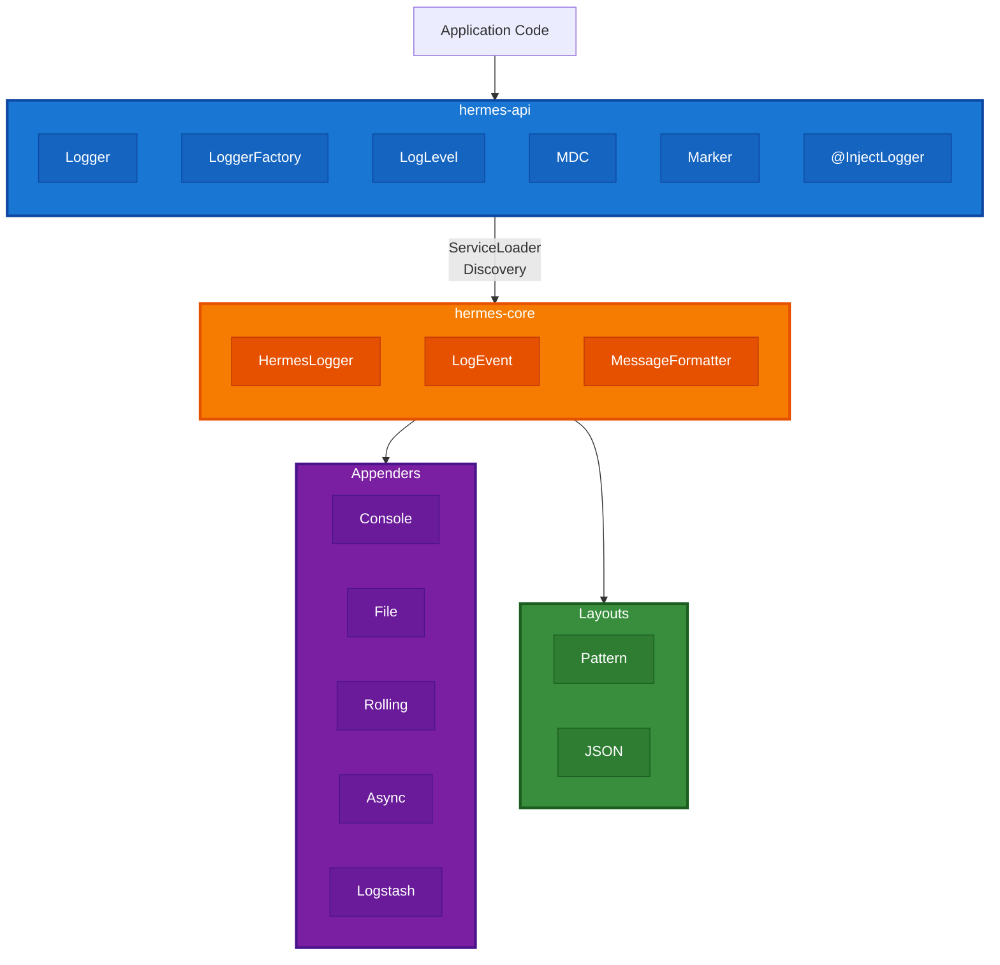
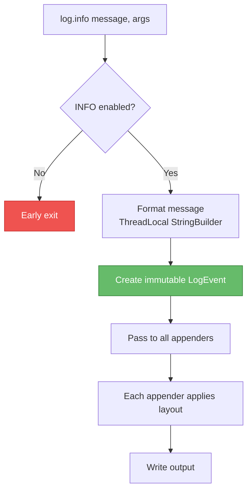
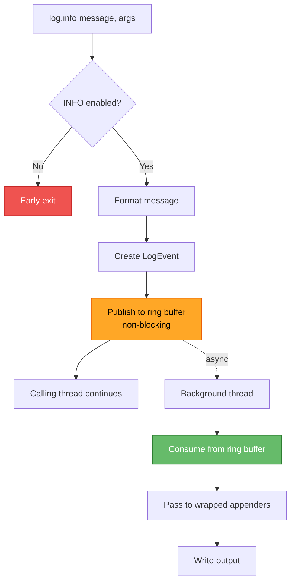
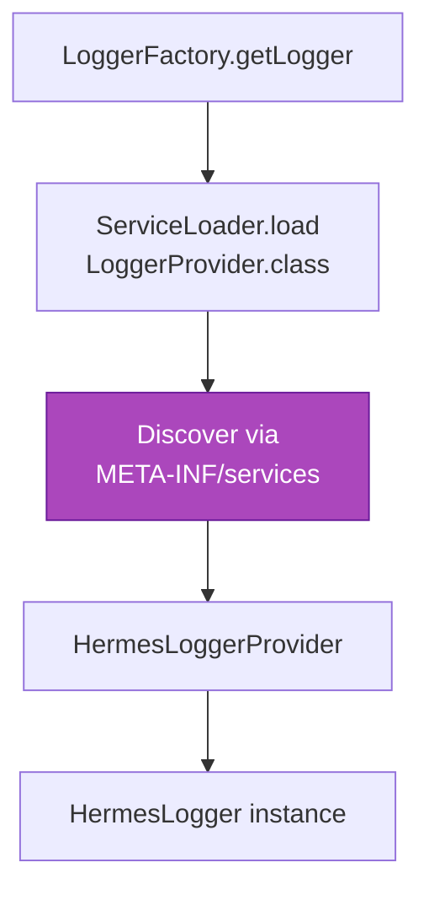

# Architecture Overview

Hermes is designed as a high-performance, modular logging library with a focus on developer experience and zero-allocation optimization.

## Design Principles

1. **Performance First**: Zero-allocation message formatting, async logging with LMAX Disruptor
2. **Developer Experience**: Zero-boilerplate logger injection via compile-time annotation processing
3. **Modularity**: Clear separation between API, implementation, and integrations
4. **GraalVM Native**: Full support for AOT compilation without reflection
5. **Type Safety**: Compile-time checks, no runtime surprises

## High-Level Architecture



## Core Components

### API Layer (hermes-api)

**Purpose**: Define the public contract

- `Logger`: Main logging interface
- `LoggerFactory`: Logger instance creation
- `@InjectLogger`: Annotation for automatic logger injection
- `MDC`: Mapped Diagnostic Context
- `Marker`: Log event categorization
- `LogLevel`: Log level enumeration

**Design**: Pure interfaces with no implementation dependencies

### Implementation (hermes-core)

**Purpose**: High-performance logging engine

- `HermesLogger`: Concrete Logger implementation
- `LogEvent`: Immutable log event record
- `MessageFormatter`: Zero-allocation message formatting
- `Appender`: Output destination abstraction
- `Layout`: Log event formatting

**Optimizations**:

- Early exit (level checking before formatting)
- ThreadLocal StringBuilder (zero-allocation formatting)
- Immutable LogEvent (thread-safe for async)
- LMAX Disruptor (lock-free async logging)

### Annotation Processor (hermes-processor)

**Purpose**: Compile-time logger field generation

- Processes `@InjectLogger` annotations
- Generates base classes with `protected Logger log` field
- Runs during Maven/Gradle compilation
- Zero runtime overhead

### Spring Boot Starter (hermes-spring-boot-starter)

**Purpose**: Auto-configuration for Spring Boot

- `HermesAutoConfiguration`: Auto-configures logging
- `HermesProperties`: Binds to `hermes.*` properties
- `HermesLoggingHealthIndicator`: Health check integration

### Kotlin DSL (hermes-kotlin)

**Purpose**: Idiomatic Kotlin extensions

- Extension properties for logger creation
- Lazy evaluation with lambdas
- MDC scope functions
- Structured logging DSL

## Data Flow

### Synchronous Logging



### Asynchronous Logging



## ServiceLoader Pattern

Hermes uses Java's ServiceLoader for provider discovery:



**Benefits**:

- Decouples API from implementation
- Supports custom implementations
- Works in GraalVM native images

## Thread Safety

### Thread-Local Components

- `MessageFormatter`: ThreadLocal StringBuilder per thread
- `MDC`: ThreadLocal map per thread

### Immutable Components

- `LogEvent`: Immutable record, safe to pass between threads
- `Logger`: Thread-safe singleton per class

### Concurrent Components

- `AsyncAppender`: Lock-free ring buffer (LMAX Disruptor)
- `Appender`: Must be thread-safe (multiple threads may log)

## Memory Management

### Zero-Allocation Path

1. Check log level (no allocation)
2. Retrieve ThreadLocal StringBuilder (reused)
3. Format message into StringBuilder (no new String)
4. Create LogEvent (single allocation)
5. Pass to appenders

**Result**: Only 1 allocation per enabled log statement

### Async Buffer

- Pre-allocated ring buffer of LogEvent slots
- Fixed memory footprint
- No GC pressure from logging

## Performance Characteristics

### Latency

- **Level check**: ~1-2ns
- **Disabled log statement**: ~2-5ns (early exit)
- **Enabled log statement (sync)**: ~50-100ns
- **Enabled log statement (async)**: ~500-1000ns (publish to ring buffer)

### Throughput

- **Synchronous**: ~1-2M messages/sec
- **Asynchronous**: ~10-15M messages/sec

### Memory

- **Logger instance**: ~100 bytes
- **LogEvent**: ~200 bytes
- **ThreadLocal StringBuilder**: ~2KB per thread
- **Async ring buffer**: (queue-size × 200 bytes)

## Extension Points

### Custom Appenders

Implement `Appender` interface:

```java
public interface Appender {
    void append(LogEvent event);
    void start();
    void stop();
    boolean isStarted();
    void setLayout(Layout layout);
}
```

### Custom Layouts

Implement `Layout` interface:

```java
public interface Layout {
    String format(LogEvent event);
}
```

### Custom Logger Provider

Implement `LoggerProvider` interface and register via ServiceLoader.

## Design Decisions

### Why Annotation Processing?

**Alternatives**: Lombok, AspectJ, runtime reflection

**Chosen**: Annotation processing

**Reasons**:

- Zero runtime overhead
- GraalVM native-image compatible
- IDE support (auto-completion)
- Compile-time errors

### Why LMAX Disruptor?

**Alternatives**: ArrayBlockingQueue, LinkedBlockingQueue

**Chosen**: LMAX Disruptor

**Reasons**:

- Lock-free (no contention)
- ~10x faster than blocking queues
- Mechanical sympathy (cache-friendly)
- Battle-tested (used by LMAX Exchange)

### Why ThreadLocal StringBuilder?

**Alternatives**: StringBuilder per call, String concatenation

**Chosen**: ThreadLocal StringBuilder

**Reasons**:

- Zero allocation (reused)
- Thread-safe (thread-local)
- Fast (no synchronization)

### Why Immutable LogEvent?

**Alternatives**: Mutable LogEvent, pooled events

**Chosen**: Immutable record

**Reasons**:

- Thread-safe for async
- Simple reasoning
- Compact memory layout (Java 17 records)

## Future Enhancements

Potential future additions:

1. **Filters**: Pre-appender filtering by level/marker/MDC
2. **Dynamic Configuration**: Runtime level changes without restart
3. **Metrics**: Built-in logging metrics (throughput, dropped events)
4. **Batching**: Batch writes for network appenders
5. **Compression**: Automatic log compression for file appenders
